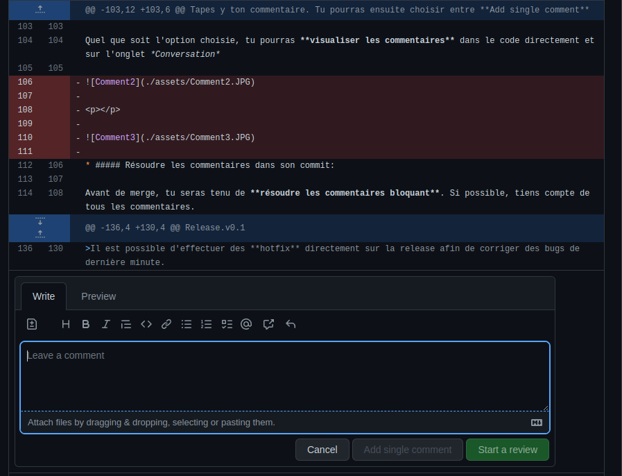
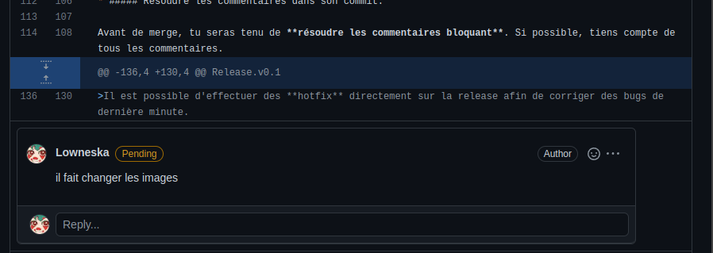
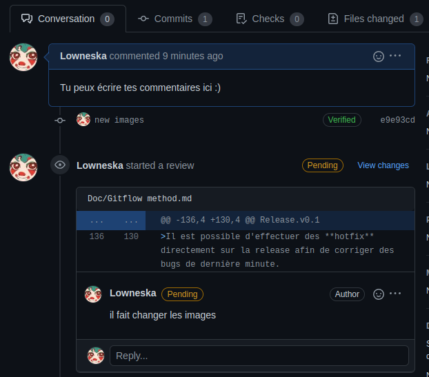

# La méthode Gitflow


Le principe de la méthode Gitflow repose sur la **copie du répertoire** de l'application et la **gestion de version**. 
>**Une copie du répertoire est appellée branche**.

>**Lorsqu'on effectue une copie d'une branche, on dit qu'on *tire une branche***

>**Lorsqu'on fusionne une branche dans une autre (par exemple pour mettre son travail sur la develop), on dit qu'on *merge dans une branche***

Un projet utilisant Gitflow est généralement découpé en **deux branches principales**:

###### Master:
C'est la branche qui **contient le code source** de l'application **tel qu'il est en production**.

>Dans notre projet elle est nommée *main*

###### Develop
C'est la **copie principale**. C'est à partir de cette branche que sont tirées et mergées les branches des développeurs. Elle n'est jamais mergée directement dans la master.

Et c'est tout. Toute la méthode Gitflow repose sur une interraction avec ces deux entités dans le cadre d'une **intégration continue**. Voici quelques aspect essentiels de cette méthode. 

[1.Branches et types de tâches](#1.branches-et-types-de-tâches)

[2.Commits](#2.commits)

[3.Review (Comments)](#3.review-(comments))

[4.Merge](#4.merge)

[5.Releases](#5.releases)


<a name=1.branches-et-types-de-tâches></a>
## 1.Branches et types de tâches

Les branches Gitflow sont représentées en en-tête du document. 
Les principales tâches que l'on va effectuerer (donc branches que l'on va tirer) sont des trois types suivants:

>##### feat:
>>Tâche de feature : consiste à l'ajout de fonctionnalités nouvelles dans l'application ou à la refactorisation de fonctionnalité déjà présente mais nécessistant une mise à jour

>##### fix: 
>>Tâche de correction des bugs

>##### hotfix: 
>>Tâche de fix effectuée **directement à partir de la master ou de release** (branche main)

Il existe un autre type de tâche, exécuté ponctuellement:

>##### release
>>branche tirée spécialement à partir de la develop **en vue d'une livraison sur la master**
Voire la partie sur la [release](#5.releases).

<a name=2.commits></a>
## 2.Commits

Lorsqu'une branche est tirée, elle est **identique à sa branche d'origine**. Il est donc nécessaire d'[effectuer des commits](./Starting%20on%20tasks.md/#3.effectuer-des-commits) régulièrement (points sur chaque branche du schéma).
Un commit correspond à une **version de la branche**. 
Ce sont les commits qui seront soumis à une [pull request](./Starting%20on%20tasks.md/#4.-soumettre-la-branche-à-une-pull-request) lors du merge de la branche. 

Il est possible de **gérer la version**, c'est à dire de faire revenir la branche à des commits antérieurs. 

Pour cela on utilise la commande:
```
git resert --option HEAD~n
```

avec **n** valant le **nombre de commit à annuler** en partant du plus récent et **--option** valant:
* **--soft** : les commits sont annulés, mais les modifications sont conservées (donc visible dans l'onglet *Changement*)
* **--hard** : la branche revient à la version -n.

En pratique une branche aura **un seul commit** mis à jour par un *git commit --amend --no-edit*. Les commandes précédentes ne servent en théorie qu'en cas d'erreur (notament lors des rebases, cela peut arriver d'embarquer des commits appartenant à d'autres développeurs)

<a name=3.review-(comments)></a>
## 3.Review (Commentaires et approbation)

Quand une *pull request* est créée, elle recquiert l'aval des autres développeurs (histoire de pas etre largué sur ce que fait l'autre). 

* ##### Review le code d'un autre développeur:

Pour review le code d'une *pull request*, il faut aller dans l'onglet **Pull Request** de Github, et cliquer sur la *pull request* à review. 


Une fois dans la pull request, il faudra aller dans l'onglet **File changes**. C'est là que se trouvent les modifications apportées au repo. 
Pour ajouter un commentaire sur le code, **cliquer sur la croix bleue qui apparaît au survol d'une ligne de code**.



Tapes y ton commentaire. Tu pourras ensuite choisir entre **Add single comment**, qui laissera un simple commentaire, ou **Start a review** (également disponible tout en haut des fichiers). Ce dernier t'amèneras dans l'onglet *Conversation*, et te proposera plusieurs options:

>Laisser un commentaire

>Approver le commit: *sera enregistré comme une approbation*

>Réclamer un changement: *mettra en pending le commit, bloquant le merge*

Quel que soit l'option choisie, tu pourras **visualiser les commentaires** dans le code directement et sur l'onglet *Conversation* (oui j'ai écris "fait" au lieu de "faut", ne fais pas attention)



<p></p>



* ##### Résoudre les commentaires dans son commit:

Avant de merge, tu seras tenu de **résoudre les commentaires bloquant**. Si possible, tiens compte de tous les commentaires. 
Apportes les éventuelles corrections à ta branche, et push les dans ton commit, puis valide les commentaires. 

Habituellement il faut également l'aval d'un testeur avant le merge.

>*Procédure de test en attente de la mise en place de l'environement*

<a name=4.merge></a>
## 4.Merge

[Mergez votre branche](./Starting%20on%20tasks.md/#5.-merger-votre-branche-dans-la-develop).

<a name=5.releases></a>
## 5.Releases

Régulièrement, les travaux effectués **sur la develop** doivent être **mis en production sur la master**. Cependant, 
### on ne merge pas la develop dans la master
Cela signifierait **la perte de tous les travaux en cours.**
Il va falloir tirer une branche spéciale : une **release**. Celle-ci est nommée *release*, avec un **numéro de version**.
```
Release.v0.1
```
>Il est possible d'effectuer des **hotfix** directement sur la release afin de corriger des bugs de dernière minute.
Sinon, pas de branches de feat ou de fix !

La **release est tirée depuis la develop**. Puis, lors d'une **mise en production** (ou MEP), elle est **mergée dans la master**. La master doit alors être redéployée. 
